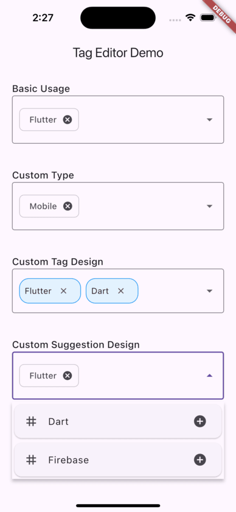

# AutoCompleteTagEditor

[](https://pub.dev/packages/autocomplete_tag_editor)
[](https://opensource.org/licenses/MIT)

A versatile Flutter tag input widget with autocomplete suggestions and custom tag creation capabilities.

<!-- Add screenshot here -->


## Features

- 🏷️ **Generic Type Support** - Works with String or any custom object type
- 🔍 **Smart Autocomplete** - Filter suggestions as you type
- ✨ **Custom Tag Creation** - Allow new tags not in suggestions
- 📱 **Responsive Layout** - Automatic line wrapping for tags
- 🎨 **Customizable UI** - Match your app's theme
- 🧩 **Overlay Suggestions** - Position-aware dropdown list
- ✅ **Validation Support** - Built-in input validation
- ⚡ **Performance** - Efficient filtering and rendering

## Installation

Add to your `pubspec.yaml`:

```yaml
dependencies:
  autocomplete_tag_editor: ^1.0.0
```

## Basic Usage

### String Tags with Customization

```dart
AutoCompleteTagEditor<String>(
  suggestions: ['Flutter', 'Dart', 'Firebase'],
  value: const ['Flutter'],
  displayValueBuilder: (option) => option,
  allowCustomTags: true,
  onTagsChanged: (tags) => print('Selected tags: $tags'),
  inputDecoration: InputDecoration(
    labelText: 'Add Tags',
    border: OutlineInputBorder(),
  ),
)
```

### Custom Type Tags

```dart
class TagData {
  final String id;
  final String name;

  TagData(this.id, this.name);
}

AutoCompleteTagEditor<TagData>(
  suggestions: [
    TagData('1', 'Mobile'),
    TagData('2', 'Web'),
  ],
  value: const [],
  displayValueBuilder: (option) => option.name,
  allowCustomTags: true,
  onCreateCustomTag: (input) => TagData(Uuid().v4(), input),
)
```

## Advance Usage

### Custom Tag Design

```dart
AutoCompleteTagEditor<String>(
  tagBuilder: (context, tag, onDeleted) => Container(
    padding: const EdgeInsets.symmetric(horizontal: 8, vertical: 4),
    decoration: BoxDecoration(
      color: Colors.blue[100],
      borderRadius: BorderRadius.circular(16),
    ),
    child: Row(
      mainAxisSize: MainAxisSize.min,
      children: [
        Text(tag),
        IconButton(
          icon: const Icon(Icons.close, size: 16),
          onPressed: onDeleted,
        ),
      ],
    ),
  ),
)
```

### Custom Suggestion Design

```dart
AutoCompleteTagEditor<String>(
  suggestionItemBuilder: (context, suggestion, onSelected) => Card(
    child: ListTile(
      leading: const Icon(Icons.tag),
      title: Text(suggestion),
      trailing: const Icon(Icons.add_circle),
      onTap: onSelected,
    ),
  ),
)
```

### Custom Filter Logic

```dart
AutoCompleteTagEditor<String>(
  suggestionFilter: (suggestion, query) {
    // Implement custom filtering logic
    return suggestion.toLowerCase().startsWith(query.toLowerCase());
  },
)
```

## Parameters

| Parameter             | Type                     | Required | Description                                                    |
| --------------------- | ------------------------ | -------- | -------------------------------------------------------------- |
| suggestions           | List<T>                  | No       | Available options for autocomplete                             |
| value                 | List<T>                  | No       | Initially selected tags                                        |
| displayValueBuilder   | DisplayValueBuilder<T>   | Yes\*    | Converts T instance to display string                          |
| inputDecoration       | InputDecoration          | No       | Decoration for the input field                                 |
| allowCustomTags       | bool                     | No       | Enable creation of tags not in suggestions (default: false)    |
| onCreateCustomTag     | CreateCustomTag<T>       | No       | Required when using non-String types with allowCustomTags=true |
| onTagsChanged         | ValueChanged<List<T>>    | No       | Callback when tags change                                      |
| tagBuilder            | TagBuilder<T>            | No       | Custom widget builder for tags                                 |
| suggestionItemBuilder | SuggestionItemBuilder<T> | No       | Custom widget builder for suggestion items                     |
| suggestionFilter      | SuggestionFilter<T>      | No       | Custom filtering logic for suggestions                         |

### Important Notes

⚠️ Type Safety Requirements

- When using custom types (T != String) with allowCustomTags: true,
  you must provide onCreateCustomTag
- `displayValueBuilder` must be provided for custom Types

### 💡 UI Considerations

- The widget uses Flutter's overlay system for suggestions
- Input field automatically expands with content
- Suggestions list positions dynamically based on input field size

### 🔧 State Management

- Parent widgets should manage the selected tags state if needed
- Use onTagsChanged to track tag additions/removals

## Example App

See the `/example` directory for a complete implementation. The example demonstrates:

- String tag implementation
- Custom object type tags
- Custom styling
- Validation scenarios
- Error handling

<!-- Add video demo here --><!--  -->

## Contributing

Contributions are welcome! Please follow these steps:

- Fork the repository
- Create your feature branch
- Commit your changes
- Push to the branch
- Create a new Pull Request
